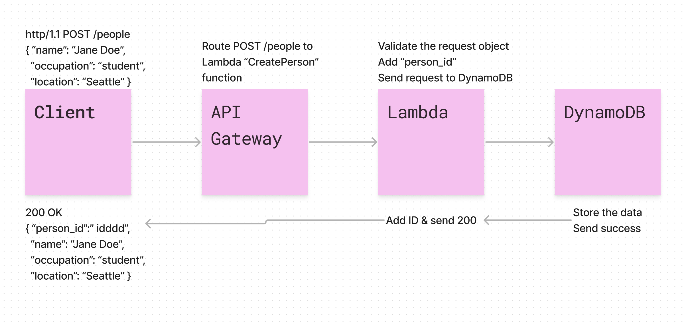

# Lab Class 18 - AWS: API, Dynamo and Lambda

## Documentation

- UML diagram

- What is the root URL to your API?  
<https://pbfmc3pkk2.execute-api.us-west-2.amazonaws.com/>
- What are the routes?  
  - POST : /people  
  - GET: /people/{person_id}
- What inputs do they require?
    - The POST route utilizes the Lambda function  `CreatePerson` to add an item to the DynamoDB `People` table
    It requires a JSON object with the person's name, occupation and location
    - The GET route uses the Lambda function `GetPerson` to get a specific item from the `People` table given its `person_id`.
- What output do they return?
    - POST returns a JSON object of the item that was created along with 200 status code.
    - GET returns a JSON object of the item corresponding to the parameter specified (`person_id`) along with status code 200.
